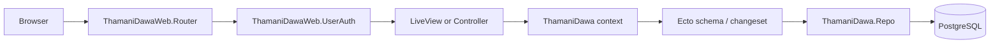

# Architecture

ThamaniDawa follows the standard Phoenix split between the web layer, context/domain modules, and `ThamaniDawa.Repo`.

## Request Flow

Browser requests enter `ThamaniDawaWeb.Router`. The `:browser` pipeline fetches sessions, flash, CSRF protection, secure headers, and `current_scope`. Controllers handle public/session pages. Authenticated LiveViews are grouped into role-specific `live_session`s with `ThamaniDawaWeb.UserAuth` `on_mount` guards.

## Directory Map

`lib/thamani_dawa/`

- `accounts*`: users, sessions, invites, roles, PINs, and request scope.
- `organizations*`: tenant creation and organization signup transaction.
- `sites*`: pharmacy, lab, and warehouse branches.
- `products*`: product catalog for drugs, lab consumables, and general supplies.
- `batches*`: stock batches, FEFO selection, and stock decrementing.
- `patients*`: organization-wide patient records.
- `prescriptions*`: prescription headers, line items, dispensing, and scan verification.
- `lab_tests*`: billable lab test catalog.
- `lab_test_templates*`: structured result templates and reference ranges.
- `lab_orders*`: lab orders, test results, second-technician verification, and consumable usage.
- `pharmacy_logs*`: monthly pharmacy log books.
- `dangerous_drug_registers*`: controlled-drug monthly registers.
- `quality_assurance_charts*`: monthly lab QA/QC charts.
- `scan_events*`: GS1 scan audit log.
- `gtin.ex` and `gs1_decoder.ex`: GS1/GTIN validation and parsing.

`lib/thamani_dawa_web/`

- `router.ex`: route map, pipelines, and role-based LiveView sessions.
- `user_auth.ex`: session handling, `current_scope`, and role guards.
- `controllers/`: public home page and login/logout controller.
- `live/`: organization, pharmacy, lab, signup, invite, scan, and workflow screens.
- `components/`: layouts, reusable core components, batch forms, and monthly log UI.

## Tech Stack

- Phoenix `~> 1.8.8` with Bandit endpoint adapter.
- Phoenix LiveView `~> 1.2.0` for portal screens and form workflows.
- Ecto SQL/Postgrex for PostgreSQL persistence.
- Bcrypt for password and PIN hashing.
- `ex_gtin` for GTIN normalization/check-digit validation.
- Swoosh with Req as the production API client option.
- Tailwind `4.3.0` and esbuild `0.25.4` via Mix aliases.
- Heroicons plus vendored daisyUI plugins are currently imported by `assets/css/app.css`.
- Credo is configured for dev/test static analysis.

## LiveView Usage

Most authenticated UI is LiveView. The app uses normal assigns and forms heavily; streams are not currently used for the listed collections. Portal LiveViews call context functions directly with `current_scope.organization_id`, and several screens lock the site selector based on the signed-in user's `site_id`.

## Docker

No `Dockerfile` or `docker-compose.yml` is present.
