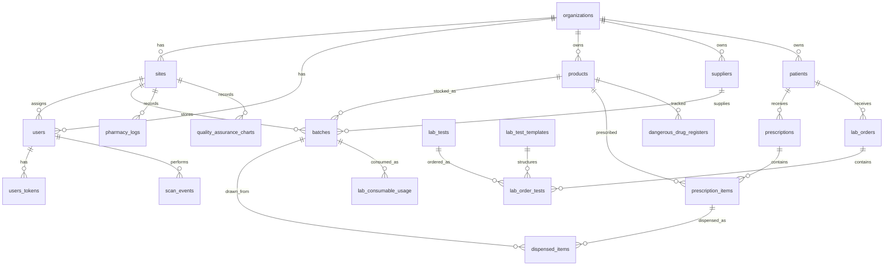

# Data Model

The data model is tenant-first. Most tables have `organization_id` and are deleted with their organization.

## Core Tables

| Table | Purpose | Notable fields |
| --- | --- | --- |
| `organizations` | Tenants | `name`, `slug`, `license_number`, `is_active` |
| `sites` | Pharmacy/lab/warehouse locations | `organization_id`, `site_type`, `gln`, `address` |
| `users` | Staff accounts | `organization_id`, `site_id`, `email`, `role`, `hashed_password`, `hashed_pin` |
| `users_tokens` | Session and invite tokens | `user_id`, `token`, `context`, `sent_to` |
| `products` | Catalog items | `product_type`, `gtin`, `generic_name`, `name`, `is_dangerous_drug`, `reorder_level` |
| `suppliers` | Vendors | `name`, `contact`, `phone`, `email`, `gln` |
| `batches` | Physical stock lots | `product_id`, `site_id`, `gtin`, `batch_no`, `expiry`, `quantity`, `remaining_quantity`, `supplier_id` |
| `patients` | Patient records | `full_name`, `date_of_birth`, `age`, `gender`, `phone`, `national_id` |
| `prescriptions` | Pharmacy order header | `site_id`, `patient_id`, `prescriber_name`, `payment_type`, `has_paid`, `status` |
| `prescription_items` | Prescription lines | `prescription_id`, `product_id`, `quantity_prescribed`, `quantity_dispensed` |
| `dispensed_items` | Actual dispense records | `prescription_item_id`, `batch_id`, `quantity`, `pharmacist_id`, `is_verified` |
| `pharmacy_logs` | Monthly pharmacy log books | `site_id`, `log_type`, `month`, `year`, `daily_entries` |
| `dangerous_drug_registers` | Controlled drug monthly registers | `site_id`, `product_id`, `entries`, `last_entry_number` |
| `lab_tests` | Billable lab tests | `name`, `price`, `subsidized_price`, `is_active` |
| `lab_test_categories` | Test category labels | `name`, `description`, `display_order` |
| `lab_test_templates` | Structured result templates | `field_definitions`, `short_name`, `display_order` |
| `lab_orders` | Lab order header | `site_id`, `patient_id`, `urgency`, `has_paid`, `status` |
| `lab_order_tests` | Ordered tests/results | `lab_order_id`, `lab_test_id`, `template_id`, `results`, `status`, performer/verifier fields |
| `lab_consumable_usage` | Lab stock consumption | `lab_order_id`, `batch_id`, `quantity`, `used_by_id`, `purpose` |
| `scan_events` | GS1 scan audit log | `gtin`, `batch_no`, `gln`, `event_type`, `reference_id`, `user_id` |
| `quality_assurance_charts` | Lab QA/QC monthly charts | `site_id`, `chart_type`, `month`, `year`, `daily_entries` |

## Uniqueness And Constraints

- `organizations.slug` is unique.
- `sites.gln` is globally unique.
- `users.email` is globally unique.
- `products` enforce unique `(organization_id, gtin)`.
- `pharmacy_logs` enforce unique `(organization_id, log_type, month, year)`.
- `dangerous_drug_registers` enforce unique `(organization_id, product_id, month, year)`.
- `lab_test_categories` and `lab_test_templates` enforce unique names per organization.
- `quality_assurance_charts` enforce unique `(organization_id, chart_type, month, year)`.

TODO: If multiple sites need independent logs/registers/charts of the same type/month, the unique indexes should include `site_id`.
