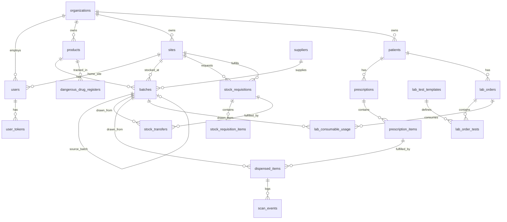
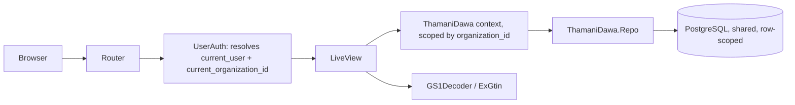

# Thamani Dawa — Pharmacy & Laboratory Information Management System

"Thamani Dawa" (Swahili: *thamani* — value/worth, *dawa* — medicine) is a **new, standalone,
multi-tenant Phoenix project** — its own repo, its own database, its own users. It is not a
second app sharing Medic's database; it borrows *design lessons* from Medic's existing
pharmacy/lab domain (field names, GS1 handling, the templated lab-results pattern) but every
schema below is owned and created by Thamani Dawa's own migrations from day one.

**Multi-tenant, top to bottom:** a pharmacist signs up, that signup creates their *organization*
(their pharmacy/lab business), and they add their own staff users under it. Every product,
batch, patient, prescription, and lab order belongs to exactly one organization. Two pharmacies
using Thamani Dawa never see each other's data.

**One schema, two shapes of business:** a single independent pharmacy and a multi-branch chain
run on the exact same tables. The difference is just how many `sites` rows an organization has,
and whether it uses the optional inter-site requisition/transfer layer ([§5](#5-single-site-vs-multi-site-chains)) —
nothing about the core receive → dispense/consume flow changes either way.

Deliberate simplifications vs. a hospital-wide system like Medic:

1. **One unified `batches` table**, not a `batches` + `drug_batches` + `lab_allocations` split.
   A batch (GTIN, batch/lot number, expiry, quantity) is the same concept whether it's a drug or
   a lab reagent — one table serves both pharmacy dispensing and lab consumption.
2. **No requisition/issuance layer for a single-site pharmacy.** A received batch sits directly
   in that site's own stock and is dispensed/consumed straight from there. The requisition layer
   in [§5](#5-single-site-vs-multi-site-chains) only comes into play once an organization has more
   than one site.
3. **One user = one organization.** A staff account belongs to exactly one pharmacy/lab business.
   There's no "pick your workspace" step at login and no cross-org membership table.

What does **not** go away: a product can (and normally will) have several `batches` rows open at
once — every restock is a new batch with its own expiry, and FEFO (first-expired-first-out)
dispensing and GS1 batch/lot traceability both depend on that history.

---

## 1. Project setup (proposed)

A fresh `mix phx.new thamani_dawa --live` project:

```elixir
def project do
  [
    app: :thamani_dawa,
    version: "0.1.0",
    elixir: "~> 1.14",
    ...
  ]
end

defp deps do
  [
    {:phoenix, "~> 1.7.19"},
    {:phoenix_live_view, "~> 1.0.0"},
    {:phoenix_ecto, "~> 4.5"},
    {:ecto_sql, "~> 3.10"},
    {:postgrex, ">= 0.0.0"},
    {:bcrypt_elixir, "~> 3.0"},
    {:ex_gtin, "~> 1.1.0"},        # GTIN-8/12/13/14, GSIN, SSCC check-digit validation
    {:scrivener_ecto, "~> 3.0"},    # pagination
    {:live_select, "~> 1.0"},       # catalog/product autocomplete
    {:csv, "~> 3.0"},               # register/report export
    {:tailwind, "~> 0.2", runtime: Mix.env() == :dev},
    {:esbuild, "~> 0.8", runtime: Mix.env() == :dev},
    {:swoosh, "~> 1.5"},            # invite emails, low-stock/expiry alerts
    {:jason, "~> 1.2"},
    {:credo, "~> 1.7", only: [:dev, :test], runtime: false}
  ]
end
```

Modules: `ThamaniDawa.*` (contexts/schemas), `ThamaniDawaWeb.*` (router/LiveViews/components) —
standard single-app Phoenix layering, no umbrella needed at this scale.

---

## 2. Multi-tenancy model

**Isolation strategy: shared database, row-level scoping.** Every tenant-owned table carries an
`organization_id` column, and every query is scoped to the current organization at the context
layer. This is the standard, simplest-to-build-correctly pattern for a SaaS at this scale — much
less operational overhead than schema-per-tenant or database-per-tenant, both of which mainly earn
their complexity when a customer has a hard regulatory/data-residency requirement for physical
isolation. **Open question:** revisit schema-per-tenant later only if a specific customer requires
it — don't build it speculatively.

### 2.1 `organizations` — the tenant

- `name` — the pharmacy/lab business name
- `slug` — optional, for a future `/o/:slug` style URL or subdomain
- `license_number` — optional, the business's pharmacy board registration (useful later for KYC)
- `is_active`

### 2.2 Enforcement

- **Every tenant table gets `organization_id`, `NOT NULL`, indexed.** Applies to: `products`,
  `suppliers`, `sites`, `batches`, `patients`, `prescriptions`, `prescription_items`,
  `dispensed_items`, `pharmacy_logs`, `dangerous_drug_registers`, `lab_tests`,
  `lab_test_categories`, `lab_test_templates`, `lab_orders`, `lab_order_tests`,
  `lab_consumable_usage`, `quality_assurance_charts`, `scan_events`, `stock_requisitions`,
  `stock_requisition_items`, `stock_transfers`, `users`.
- **Scope every context function on `organization_id`, not just at the LiveView boundary.**
  `on_mount` resolves `current_user` → assigns `current_organization_id`; every context function
  takes that id as its first argument and filters on it.
- **Uniqueness constraints move from global to per-organization.** Two different pharmacies can
  legitimately stock the same manufacturer's product with the same GTIN, so every "unique"
  constraint is `unique_index([:organization_id, <field>])`, not `unique_index([<field>])`:
  `products` (`organization_id`, `gtin`), `lab_test_templates` / `lab_test_categories`
  (`organization_id`, `name`), `pharmacy_logs` (`organization_id`, `log_type`, `month`, `year`),
  `dangerous_drug_registers` (`organization_id`, `product_id`, `month`, `year`),
  `quality_assurance_charts` (`organization_id`, `chart_type`, `month`, `year`).
- **Exception: `sites.gln` stays globally unique.** A GLN is issued by GS1 to one real-world
  location — it should never collide across organizations in practice.
- **Exception: `users.email` stays globally unique across the whole platform.** One email = one
  account = one organization in v1.
- **Defense in depth (Phase 2, optional):** Postgres Row-Level Security policies keyed on
  `organization_id` as a second guarantee under the application-level scoping.

### 2.3 Signup and adding staff

1. **Organization signup** (public, unauthenticated): creates an `organizations` row and a
   `users` row with `role: "admin"` for that org, in one transaction. This first admin is the
   org's owner. **A default `sites` row is created in the same transaction** (see
   [§5](#5-single-site-vs-multi-site-chains)) — a single-pharmacy owner never has to think about
   "sites" as a concept unless they open a second branch.
2. **Add staff** (authenticated, `admin` only): from a "Team" screen, the admin adds a user by
   name/email/role/home site. The `users` row is created unconfirmed and an invite email carries
   a one-time token; the new hire sets their own password from that link — the same `user_tokens`
   shape already proven in Medic (`Accounts.UserToken`/`users_tokens`), with an added
   `"invite"` token context.

- **`users`** — `organization_id`, `site_id` (nullable → `sites`, the staff member's home
  branch; null is fine for a single-site org, or for an org-wide admin at a chain), `name`,
  `email` (globally unique), `hashed_password` (nullable until invite accepted), `role`
  (`admin` \| `pharmacist` \| `lab_technician`), `pin`, `invited_by_id` (self-referencing →
  `users`, nullable), `is_active`.
- **`user_tokens`** — `user_id`, `token`, `context` (`"session"` \| `"invite"` \|
  `"reset_password"`), `sent_to`, `inserted_at`.

---

## 3. GS1 standards

Same GS1 baseline, written fresh in this codebase:

- **GTIN + batch/lot + expiry are mandatory** on every `batches` row.
- **GS1 DataMatrix decoding**: a `GS1Decoder` module parsing AI `01` (GTIN), `10` (batch/lot),
  `11` (production date, `YYMMDD`), `17` (expiry date, `YYMMDD`), `21` (serial number).
- **GTIN validation/normalization**: the `ex_gtin` hex package (`ExGtin.validate/1`,
  `normalize/1`, `generate/1`).
- **GLN for locations**: every site gets a real GLN ([§5](#5-single-site-vs-multi-site-chains)) —
  global uniqueness as noted in [§2.2](#22-enforcement).
- **GTIN issuance/verification against a registry** (GS1 Kenya's `create_gtin` API, or the GS1
  Global Registry Platform) — credentials in `config/runtime.exs` + environment variables from
  the start, never hardcoded in source.
- **Explicitly out of scope for v1**: SSCC logistics-unit tracking and GDSN master-data sync.

---

## 4. Data model

Every table below carries `organization_id` per [§2.2](#22-enforcement).

### 4.1 Catalog & stock

- **`products`** — `organization_id`, `generic_name`, `brand_name` (drugs), `name` (non-drug
  items), `product_type` (`drug` \| `lab_consumable` \| `general_supply`), `category`, `uom`,
  `gtin`, `is_otc`, `is_dangerous_drug`, `reorder_level`.
- **`suppliers`** — `organization_id`, `name`, `contact`, `phone`, `email`, `gln`, `is_active`.
- **`sites`** — `organization_id`, `name`, `site_type` (`pharmacy` \| `lab` \| `warehouse`),
  `gln` (globally unique), `address`, `is_active`. See [§5](#5-single-site-vs-multi-site-chains).
- **`batches`** — the one unified batch table for both pharmacy and lab stock: `organization_id`,
  `product_id`, `site_id` (where this batch physically sits), `gtin`, `batch_no`, `serial`,
  `manufacture_date`, `expiry`, `quantity`, `remaining_quantity`, `cost_per_unit`, `unit_price`,
  `supplier_id` (nullable — null when this batch arrived via an inter-site transfer rather than
  from a supplier), `source_batch_id` (nullable, self-referencing → `batches` — set when this
  batch was split off from another site's batch via a transfer, preserving GTIN/batch/expiry
  lineage across the move), `received_at`, `approver_id` (→ `users`, nullable — the staff member
  who confirmed receipt; receiving and approving are the same single step, so there is no separate
  `received_by_id`), `is_active`.

### 4.2 People

- **`patients`** — `organization_id`, `full_name`, `date_of_birth` (required, non-future — the
  sole source of truth for age; `age` is derived at display time via `Patient.age/2`, never
  persisted), `gender`, `phone`, `national_id` (all required). Scoped to the *organization*, not a
  single site — a chain's patient can be recognized at any of its branches, which is one of the
  real benefits of running multiple sites under one tenant.
- Staff accounts: `users` / `user_tokens`, see [§2.3](#23-signup-and-adding-staff).

### 4.3 Pharmacy (dispensing)

- **`prescriptions`** — `organization_id`, `site_id` (which branch filled it), `patient_id`,
  `prescriber_name`, `prescriber_reg_no`, `entered_by_id` (→ `users`), `payment_type`, `has_paid`,
  `total_amount`, `status` (`pending` \| `partially_dispensed` \| `completed` \| `cancelled`),
  `notes`.
- **`prescription_items`** — `organization_id`, `prescription_id`, `product_id`,
  `quantity_prescribed`, `dosage_instructions`, `frequency`, `duration_in_days`,
  `route_of_administration`, `quantity_dispensed`.
- **`dispensed_items`** — `organization_id`, `prescription_item_id`, `batch_id` (must be a batch
  at the prescription's own `site_id` — staff never dispense against another branch's stock
  directly; they requisition it first, see [§5](#5-single-site-vs-multi-site-chains)), `quantity`,
  `unit_price`, `pharmacist_id`, `is_verified`, `dispensed_at`.
- **`pharmacy_logs`** — `organization_id`, `site_id`, `log_type`, `month`, `year`,
  `daily_entries` (map). Site-scoped: a chain keeps one cold-chain log per branch.
- **`dangerous_drug_registers`** — `organization_id`, `site_id`, `product_id`, `month`, `year`,
  `entries` (map), `last_entry_number`. Also site-scoped — the controlled-substance register is a
  physical-location regulatory record, not an org-wide one.

### 4.4 Laboratory (LIS)

- **`lab_tests`** — `organization_id`, `name`, `price`, `subsidized_price`, `is_active`.
- **`lab_test_categories`** / **`lab_test_templates`** — `organization_id`, plus (template)
  `name`, `short_name`, `is_active`, `display_order`, `field_definitions`; (category) `name`,
  `description`, `display_order`.
- **`lab_orders`** — `organization_id`, `site_id`, `patient_visit_id` (required — sole path to the
  patient, no separate `patient_id`), `prescriber_name`, `ordered_by_id` (→ `users`, nullable),
  `urgency`, `payment_type`, `has_paid`, `total_amount`, `status`, `lab_report`, `test_findings`,
  `lab_request`, referral fields.
- **`lab_order_results`** — one row per individual test ordered. `organization_id`,
  `lab_order_id`, `lab_test_id` (FK → `lab_tests`), `template_id` (nullable, bare integer — no
  `lab_test_templates` table exists yet), `results` (map), `status`, `sample_collected_on`,
  `test_performed_on`, `performed_by_id`/`collected_by_id`/`verified_by_id` (nullable),
  `collection_notes` (free text), `sample_type` (`Ecto.Enum` — blood/urine/stool/swab, required).
- **`lab_consumable_usage`** — `organization_id`, `lab_order_id` (nullable by design — a reagent
  draw doesn't always tie back to a specific order), `batch_id`, `quantity`, `used_by_id`,
  `purpose`, `used_at`.
- **`quality_assurance_charts`** — `organization_id`, `site_id`, `chart_type`, `month`, `year`,
  `daily_entries`.

### 4.5 Multi-site requisitions & transfers (optional layer — see §5)

- **`stock_requisitions`** — `organization_id`, `requesting_site_id` (→ `sites`, the branch
  asking), `fulfilling_site_id` (→ `sites`, nullable until assigned — usually the warehouse/HQ),
  `requested_by_id` (→ `users`), `status` (`pending` \| `approved` \| `partially_fulfilled` \|
  `fulfilled` \| `rejected` \| `cancelled`), `notes`, `requested_at`.
- **`stock_requisition_items`** — `organization_id`, `requisition_id`, `product_id`,
  `quantity_requested`, `quantity_approved`, `quantity_fulfilled`.
- **`stock_transfers`** — `organization_id`, `requisition_id` (nullable — supports an ad-hoc
  branch-to-branch transfer with no formal requisition behind it), `from_site_id`, `to_site_id`,
  `source_batch_id` (→ `batches`, the batch the stock is drawn from), `quantity`,
  `transferred_by_id` (→ `users`), `transferred_at`. Executing a transfer decrements
  `source_batch_id`'s `remaining_quantity` and creates (or tops up) a `batches` row at
  `to_site_id` carrying the same `gtin`/`batch_no`/`expiry`, with `source_batch_id` set for
  lineage.

### 4.6 Traceability

- **`scan_events`** — `organization_id`, `gtin`, `batch_no`, `gln` (nullable), `event_type`
  (`receipt` \| `dispense` \| `lab_consumption` \| `transfer_out` \| `transfer_in`),
  `reference_id`, `user_id`.



---

## 5. Single site vs. multi-site chains

Both shapes of business run on [§4](#4-data-model) unchanged — the difference is purely how many
`sites` rows an organization has, and whether the requisition/transfer tables ever get used.

- **Single pharmacy or lab:** one `sites` row, auto-created at signup. Stock is always received
  directly into that site's `batches`. `stock_requisitions`/`stock_transfers` stay empty forever —
  there's nothing to requisition *from*. Staff never see a "Requisitions" nav item because a
  one-site org has no second site to request stock from — gate the screen on
  `count(organization.sites) > 1` rather than a separate plan/feature flag, so it just appears
  naturally the moment a second site is added.
- **Multi-branch chain:** the org creates additional `sites` (typically one `warehouse`-type HQ
  plus several `pharmacy`/`lab` branches). Two ways stock reaches a branch:
  1. **Direct receipt** — a branch orders from a supplier itself and receives straight into its
     own `batches`, exactly like a single-site pharmacy. Chains don't have to route everything
     through HQ.
  2. **Requisition → transfer** — a branch requests stock it doesn't have from HQ
     (`stock_requisitions` + `stock_requisition_items`), HQ approves and fulfills it
     (`stock_transfers`, split off HQ's own `batches`), and the branch receives a new `batches`
     row carrying the same GTIN/batch/expiry as the HQ batch it came from.
- **Either way, dispensing is identical.** Once a `batches` row exists at a site — whether it got
  there by direct receipt or by transfer — `prescriptions`/`lab_orders` at that site dispense
  against it the same way. The requisition layer only decides *how a batch arrives*, never *how
  it leaves*.

---

## 6. Architecture

Standard single-app Phoenix layering — `ThamaniDawaWeb` (router, LiveViews, components) →
`ThamaniDawa` (context modules: `Organizations`, `Accounts`, `Products`, `Sites`, `Batches`,
`Requisitions`, `Prescriptions`, `LabOrders`, `LabTestTemplates`) → `ThamaniDawa.Repo` →
PostgreSQL.



## 7. Authentication & roles

| Role | Access |
| --- | --- |
| `admin` | The org's owner/staff admin. Manage users, products, sites, suppliers; approve/fulfill requisitions at any site; view all reports/registers across the whole chain. |
| `pharmacist` | Receive/dispense at their home `site_id`; raise requisitions from their site. |
| `lab_technician` | Receive/consume at their home `site_id`; raise requisitions from their site. |

Password + 4-digit PIN for fast counter-side actions, same secondary-auth pattern already proven
in Medic (`docs/AUTH.md` there).

---

## 8. Base LiveViews (portals)

### 8.1 Organization / team

| Screen | Purpose | Backing schemas |
| --- | --- | --- |
| Sign up | Create an organization + its first admin + default site | `organizations`, `users`, `sites` |
| Team | List staff, invite a new user by email/role/home site | `users`, `user_tokens` |
| Sites | Manage branches/warehouse, each with its own GLN | `sites` |
| Requisitions *(shown once >1 site exists)* | Branches request stock; HQ approves/fulfills | `stock_requisitions`, `stock_requisition_items`, `stock_transfers` |

### 8.2 Pharmacy portal

| Screen | Purpose | Backing schemas |
| --- | --- | --- |
| Dashboard | Low-stock/near-expiry alerts, today's pending prescriptions | `batches`, `prescriptions` |
| Scan | Decode a GS1 code to look up a batch or verify a dispense | `GS1Decoder`, `batches` |
| Product catalog | Browse/search products by name, GTIN, category | `products` |
| Receive stock | Log a new batch against a product at this site | `batches` |
| Prescriptions | Capture a prescription, dispense against a batch, scan-to-verify | `prescriptions`, `prescription_items`, `dispensed_items` |
| Dangerous drug register | Monthly controlled-substance entries for this site | `dangerous_drug_registers` |
| Pharmacy logs | Cold-chain temperature/humidity logs for this site | `pharmacy_logs` |

### 8.3 Laboratory portal (LIS)

| Screen | Purpose | Backing schemas |
| --- | --- | --- |
| Dashboard | Pending orders, incomplete reports | `lab_orders` |
| Scan | Decode reagent/consumable batch GS1 codes | `GS1Decoder`, `batches` |
| Lab orders (worklist) | Capture walk-in orders, add tests, fill entries, mark complete | `lab_orders`, `lab_order_tests` |
| Result entry | Templated field entry with auto flag | `lab_order_tests`, `lab_test_templates` |
| Verification queue | Second-check/sign-off on completed entries | `lab_order_tests.verified_by_id` |
| Test templates & categories | Manage the structured test catalog | `lab_test_templates`, `lab_test_categories` |
| Receive stock / consumables | Log reagent batches and usage at this site | `batches`, `lab_consumable_usage` |
| Quality assurance | Monthly QA/QC charts for this site | `quality_assurance_charts` |

---

## 9. Key workflows

**Sign up and build a team**
1. A pharmacist signs up → `organizations` row + `users` row (`role: "admin"`) + one default
   `sites` row.
2. From "Team," the admin invites staff by email/role/home site → unconfirmed `users` row +
   `"invite"` `user_tokens` row; the invite link lets the new hire set their password.

**Receive stock (any site)**
1. Product exists in `products` for this organization.
2. Log a `batches` row with `gtin`/`batch_no`/`expiry` from a GS1 scan or the label, tagged to
   the receiving `site_id`, `supplier_id` set, `source_batch_id` left null.

**Walk-in prescription → dispense (any site)**
1. Pharmacist looks up or creates the `patient`, creates a `prescriptions` header
   (`site_id` = their own site) with one or more `prescription_items`.
2. Picks a `batches` row at their own site (FEFO) and records a `dispensed_items` row.
3. Scans the GS1 code, confirms it resolves to that `dispensed_items` row, marks
   `is_verified: true`, logs a `scan_events` row (`event_type: "dispense"`).

**Lab order → verified result (any site)**
1. Lab technician captures a walk-in `lab_orders` header (`site_id` = their own site) and adds
   `lab_order_tests` from `lab_test_templates`.
2. Entering `results` auto-computes each field's `flag` against the template's reference range.
3. A second technician verifies; `lab_orders.status` moves to `verified`.
4. Reagent draws log in `lab_consumable_usage` against a `batches` row at that site.

**Inter-site requisition & transfer (multi-site chains only)**
1. A branch raises a `stock_requisitions` header + `stock_requisition_items` for what it's short
   of.
2. HQ (or another branch) reviews it, sets `quantity_approved`, and creates one or more
   `stock_transfers` against its own `batches`.
3. Each transfer decrements the source batch's `remaining_quantity` and creates/tops up a
   `batches` row at the receiving branch with the same GTIN/batch/expiry, `source_batch_id` set
   for lineage; optionally scan-verified at both ends (`scan_events`
   `event_type: "transfer_out"` / `"transfer_in"`).
4. The requisition's status moves to `fulfilled` once its items are covered.
5. The branch now dispenses from that batch exactly as in the direct-receipt workflow above — no
   different code path.

**GLN site lookup**
1. Scanning a site's AI-`414` GS1 code resolves straight to a `sites` row for that organization.

---

## 10. Roadmap

- **Phase 1 (MVP):** `organizations`/signup with a default `sites` row, `users`/`user_tokens`/
  invite flow, `products`, `batches`, `patients`, `prescriptions` → `dispensed_items` dispensing
  with scan-to-verify, `lab_orders` → `lab_order_tests` with templated results and
  auto-flagging, single-site GLN. Everything works end to end for a single pharmacy/lab with no
  requisition concept visible at all.
- **Phase 2:** multi-site support — adding a second `sites` row surfaces the `stock_requisitions`
  / `stock_requisition_items` / `stock_transfers` screens; `pharmacy_logs`,
  `dangerous_drug_registers`, `quality_assurance_charts` become site-scoped; `scan_events`
  traceability log; low-stock/near-expiry alerting per site; Postgres RLS as defense in depth.
- **Phase 3 (future, not required now):** AI-assisted lab interpretation, SSCC-based logistics
  tracking for larger transfers, GDSN master-data sync, schema-per-tenant migration path if a
  customer ever requires physical data isolation, a platform-level support/ops role across
  organizations.

---

## 11. Open questions

- Whether requisition approval needs a dedicated role (e.g. a "warehouse manager" distinct from
  `admin`/`pharmacist`) once chains are large enough that the owner isn't personally approving
  every transfer.
- Whether `patients` needs a stable external identifier (e.g. national ID lookup) for repeat
  customers, or name+phone matching is good enough at this scale.
- Whether prescriptions/lab orders ever need a structured *internal* prescriber (i.e. a doctor
  role in this system) rather than always treating the prescriber as external free text.
- Whether a user will ever need to belong to more than one organization (e.g. a relief
  pharmacist covering two unrelated shops, not two branches of the same chain) — v1 assumes not.
- Whether Thamani Dawa's own operators need a platform-level view across all organizations for
  support/billing — not built in v1, noted in the Phase 3 roadmap only.
