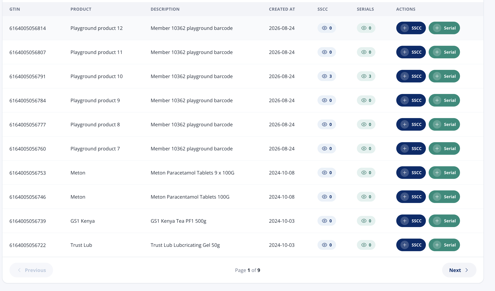
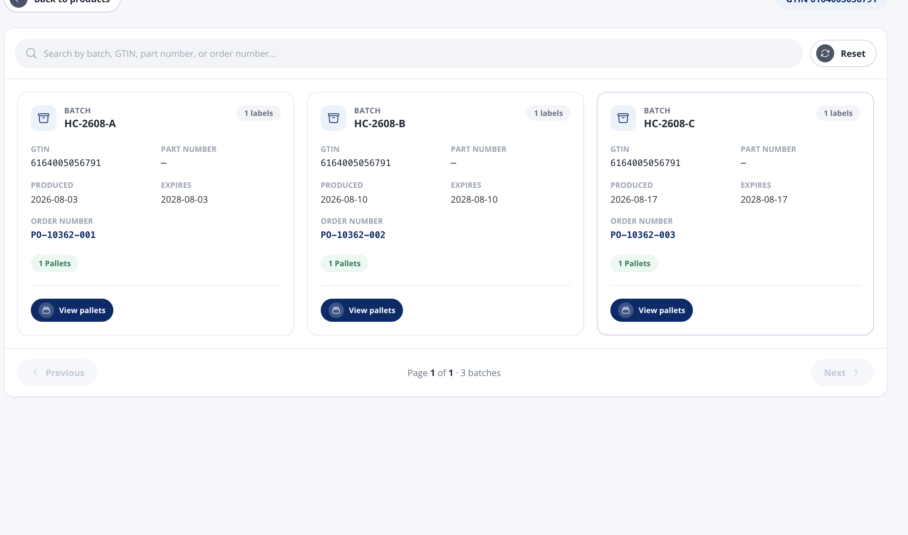
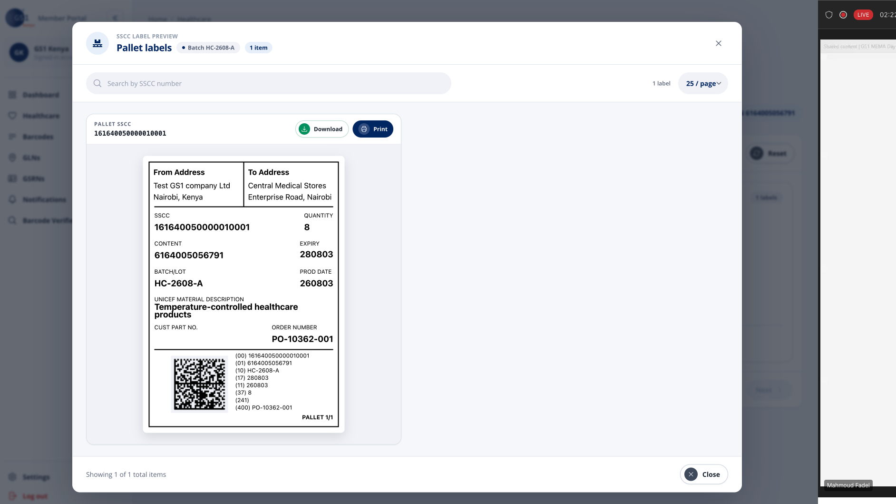
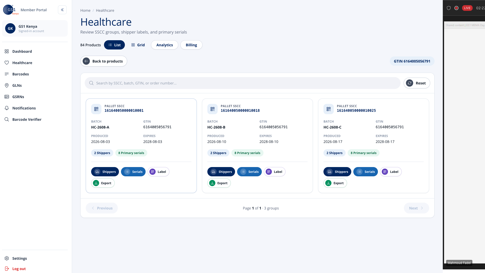
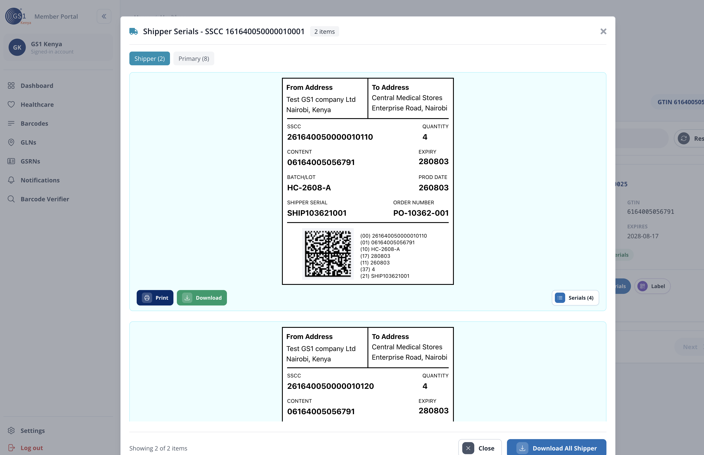
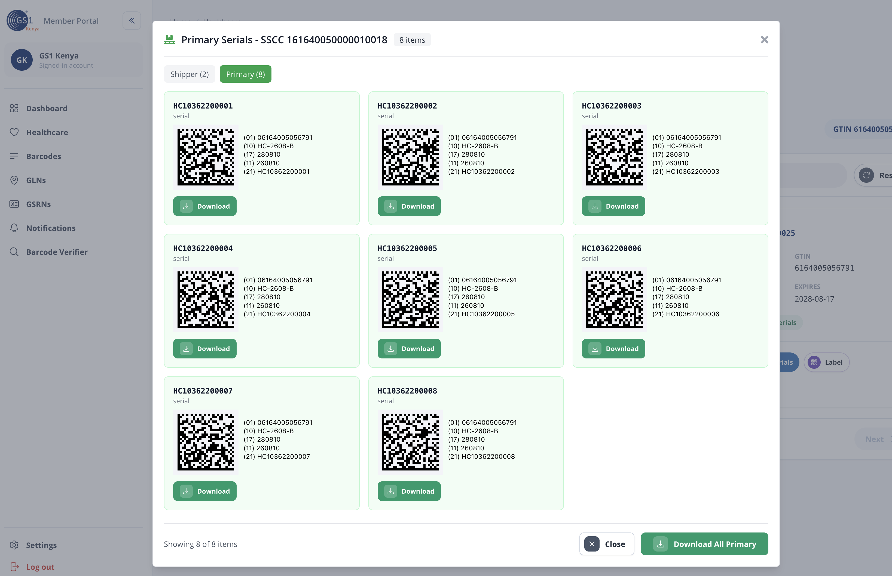
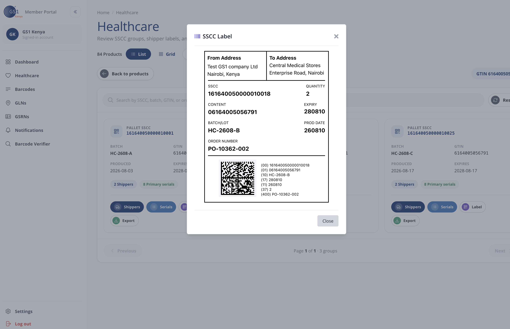

# Serialisation Module — UI and Functional Flow Specification

This document defines the member-facing UI and interaction flow that the
serialisation module in `thamani_dawa` must reproduce. It complements the
standalone serialisation architecture/API specification; that document remains
authoritative for APIs, persistence, billing enforcement, identifier issuance,
and GS1 business rules.

The screenshots referenced below are visual references, not sources of sample
data that should be hard-coded. Values such as GTINs, batches, dates, addresses,
counts, serials, and order numbers must always come from the signed-in
organization's records and GS1 API responses.

## 1. Reference images

The screenshots live in `docs/images/serialisation/` under these stable names:

| Reference | Filename                               | Shows                                |
| --------- | -------------------------------------- | ------------------------------------ |
| UI-01     | `serialisation-01-product-list.png`    | Product list and per-product actions |
| UI-02     | `serialisation-02-batch-list.png`      | Batch cards for a selected product   |
| UI-03     | `serialisation-03-pallet-labels.png`   | Pallet-label preview modal           |
| UI-04     | `serialisation-04-sscc-groups.png`     | SSCC group cards for a selected GTIN |
| UI-05     | `serialisation-05-shipper-serials.png` | Shipper serial labels modal          |
| UI-06     | `serialisation-06-primary-serials.png` | Primary serial Data Matrix modal     |
| UI-07     | `serialisation-07-sscc-label.png`      | Single SSCC label modal              |

**UI-01 — product list**



**UI-02 — batch list**



**UI-03 — pallet-label preview modal**



**UI-04 — SSCC group list**



**UI-05 — shipper serials modal**



**UI-06 — primary serials modal**



**UI-07 — single SSCC label modal**



## 2. Required user journey

```text
Serialisation product list
  ├─ SSCC action ──> SSCC generation form ──> generated batches
  │                                            └─ View pallets
  │                                                └─ pallet-label modal
  └─ Serial action -> serialised generation form -> SSCC group list
                                               ├─ Shippers modal
                                               │   └─ serials for one shipper
                                               ├─ Primary serials modal
                                               ├─ SSCC label modal
                                               └─ Export generated data
```

Viewing previously generated records must remain available even when an
organization has no active allowance or has exhausted its allocation. Apply
prefix, bank, entitlement, plan, and capacity guards only when the user enters
or submits a generation flow.

## 3. Shared page shell and visual language

Use the existing `thamani_dawa` organization shell, authentication, flash
messages, and route guards. The screenshots' sidebar is a visual reference; do
not reintroduce navigation items that the distributor tenancy rules intentionally
hide.

The reference UI uses:

- a very light blue-grey page background;
- white panels/cards with subtle cool-grey borders and small shadows;
- dark GS1 navy for headings, identifiers, and primary SSCC actions;
- teal/green for serial, download, and primary-item actions;
- medium blue for shipper/serial-list actions;
- purple for label-preview actions;
- rounded pill buttons and count badges;
- uppercase, muted field labels above darker field values;
- monospaced numerals for GTIN, SSCC, serial, batch, and order identifiers.

Preserve the host application's typography and design tokens where available.
Match the hierarchy, spacing, action colors, and information density rather
than copying screenshot pixels into isolated CSS values.

All icon buttons require text or an accessible label. Buttons need visible
hover and keyboard-focus states. Do not use color alone to convey type or
state.

## 4. Screen A — serialisation product list

### Purpose

This is the module landing page. It lets a distributor find a product, inspect
existing generated counts, or begin SSCC/serialised generation.

### Layout

Render a paginated table on desktop with these columns, in this order:

1. `GTIN`
2. `Product`
3. `Description`
4. `Created at`
5. `SSCC`
6. `Serials`
7. `Actions`

Each row displays:

- a 13- or 14-digit GTIN without numeric formatting;
- product name and description;
- creation date in the application's locale;
- a clickable SSCC count badge with an eye icon;
- a clickable serial count badge with an eye icon;
- `+ SSCC` in navy;
- `+ Serial` in green/teal.

The count badges open existing results and must work when their value is above
zero. For a zero count they may be disabled or open a clear empty state, but
must not imply that data exists.

Include search, supported sort controls, a loading state, empty state, error
state, and pagination. Default to 10 products per page. Pagination displays
`Page X of Y`; Previous is disabled on the first page and Next on the last.

On narrow screens, replace table rows with cards while preserving all fields
and actions. Never require horizontal scrolling merely to reach an action.

### Actions

- `+ SSCC` opens the single-GTIN SSCC generation flow for that product.
- `+ Serial` opens the serialised Data Matrix generation flow for that product.
- SSCC count opens the product's batch/pallet results.
- Serial count opens the product's generated SSCC groups.

Search and pagination state should be encoded in URL query parameters so that
Back returns the user to the same list position.

## 5. Screen B — generated batch list

### Purpose

Show the batches generated for the selected product before the user drills
into pallet labels.

### Header and controls

- `Back to products` returns to Screen A without losing its query state.
- Display a `GTIN <value>` badge at the upper right.
- Provide one search field with placeholder
  `Search by batch, GTIN, part number, or order number...`.
- `Reset` clears search/filter state and returns to page 1.

### Batch card

Use a three-column grid on wide screens, collapsing to two and then one column.
Each card contains:

- eyebrow `BATCH` and the batch identifier;
- a label count badge;
- GTIN;
- customer part number, with an em dash when absent;
- produced date;
- expiry date;
- order number;
- pallet count badge;
- `View pallets` primary action.

Identifiers must not wrap in a way that changes their meaning. The footer shows
`Page X of Y · N batches` and standard Previous/Next controls.

### `View pallets`

Open the pallet-label preview modal described in Screen C. The selected batch
must be represented in modal state or route params so a refresh/deep link can
recover it when practical.

## 6. Screen C — pallet-label preview modal

Open a large modal over a dimmed page. The modal header contains:

- label/context icon;
- eyebrow `SSCC LABEL PREVIEW`;
- title `Pallet labels`;
- `Batch <batch>` badge;
- total-item badge;
- close icon.

Below the header provide:

- search by SSCC number;
- total result count;
- page-size selector, default 25;
- a scrollable label-results region;
- footer text `Showing A–B of N total items`;
- a Close button.

Each result card shows `PALLET SSCC <code>`, a rendered label, `Download`, and
`Print`. Download returns a useful image or PDF filename containing the SSCC.
Print prints only the selected label at its intended dimensions—not the modal
chrome or background page.

The label itself is specified in section 10.

## 7. Screen D — generated SSCC group list

### Purpose

Show serialised-generation results grouped by pallet SSCC for the selected
GTIN. This is the main drill-down surface in UI-04.

### Header and search

Retain the module title/subtitle and list/grid controls from the host app.
Display `Back to products`, a selected GTIN badge, a search field with
placeholder `Search by SSCC, batch, GTIN, or order number...`, and Reset.

### SSCC group card

Render up to three cards per row on desktop. Each card includes:

- eyebrow `PALLET SSCC` and the SSCC;
- batch;
- GTIN;
- produced date;
- expiry date;
- `<N> Shippers` badge;
- `<N> Primary serials` badge;
- `Shippers` action;
- `Serials` action;
- `Label` action;
- `Export` action.

Action mapping:

- `Shippers` opens Screen E with the Shipper tab active.
- `Serials` opens Screen F with the Primary tab active.
- `Label` opens Screen G.
- `Export` downloads the complete machine-readable data for that SSCC group.

The card counts and modal counts must derive from the same loaded data. Do not
display example values such as 2 and 8 unless those are the actual counts.

Footer: `Page X of Y · N groups`, plus Previous/Next disabled appropriately.

## 8. Screens E and F — shipper and primary serial modals

These are two views of the same modal component. Switching tabs must not close
the modal or refetch unchanged group metadata.

### Shared behavior

- Large, centered, scrollable modal over a dimmed page.
- Header title reflects the active view and selected SSCC:
  `Shipper Serials - SSCC <code>` or
  `Primary Serials - SSCC <code>`.
- Show an item-count badge and close icon.
- Tabs show live counts: `Shipper (N)` and `Primary (N)`.
- The modal footer remains visible while results scroll.
- Escape and the close controls close the modal and restore focus to the
  trigger button.

### Shipper tab

Each shipper label includes:

- from and to address;
- shipper SSCC;
- quantity of primary items in the shipper;
- content GTIN;
- expiry and production dates in `YYMMDD` on artwork;
- batch/lot;
- shipper serial;
- order number;
- Data Matrix and human-readable AI lines;
- `Print` and `Download` actions;
- `Serials (N)` action to inspect the primary serials assigned to that shipper.

The footer provides `Download All Shipper`, producing one ZIP or multi-page PDF
according to the selected export format. Empty shippers show a proper empty
state rather than a blank modal.

### Primary tab

Display primary serials in a responsive three-column card grid. Each card
contains:

- the serial as its heading;
- type label `serial`;
- Data Matrix image;
- human-readable AIs for GTIN, batch, expiry, production, and serial;
- `Download`.

The footer provides `Download All Primary`. The bulk file must contain exactly
the records represented by the selected SSCC group, including any active
search/filter if the UI labels the action as downloading filtered results.

## 9. Screen G — single SSCC label modal

Open a compact modal titled `SSCC Label` with a close icon, one centered label
preview, and a footer Close button. This view is for quick inspection. If print
or download controls are added, use the same implementation as Screen C.

## 10. Label artwork contract

The UI previews are operational labels, not decorative mockups. Generate them
from persisted GS1 response data and ensure the Data Matrix decodes to the
human-readable application identifiers shown beside it.

### Pallet SSCC label

Display, where available:

- From Address and To Address;
- SSCC;
- quantity;
- content GTIN;
- expiry;
- batch/lot;
- production date;
- material description;
- customer part number;
- order number;
- Data Matrix;
- human-readable `(00)`, `(01)`, `(10)`, `(17)`, `(11)`, `(37)`, and `(400)`
  lines as applicable;
- pallet sequence such as `PALLET 1/1`.

### Shipper label

Display the common address, SSCC, quantity, content GTIN, dates, batch, order,
and Data Matrix fields, plus shipper serial AI `(21)`.

### Primary serial card

Display `(01)` GTIN, `(10)` batch, `(17)` expiry, `(11)` production, and `(21)`
serial. Use GS1-provided payloads/serials; never mint identifiers in the UI or
derive a missing code locally.

### Rendering and output

- Preserve leading zeroes in every code.
- Render identifiers as strings, never floating-point or formatted numbers.
- Use print CSS with physical label dimensions and high-contrast black artwork.
- The downloadable artifact and on-screen preview must contain identical data.
- Validate every generated symbol with an automated decoder test.
- Prefer vector/PDF or sufficiently high-resolution raster output for printing.

## 11. Generation flow requirements

The existing architecture specification defines the form fields and API
contracts. Integrate them into the UI above as follows:

1. User starts from `+ SSCC` or `+ Serial` on a specific product.
2. Load current member profile/entitlements and usage state.
3. If generation is unavailable, show the established GS1 message and a useful
   path to configuration, plans, or billing; do not block historical viewing.
4. Validate required fields client-side, then submit once with a persisted
   request/idempotency key.
5. Disable duplicate submission and show progress. Large runs use an async job
   with status polling and a resumable progress state.
6. On success, persist the returned identifiers before navigating to the
   appropriate result screen.
7. On ambiguous timeout, do not automatically create another request. Show a
   reconciliation/pending state.
8. On failure, retain entered form values and surface the API's member-safe
   error without fabricating partial success.

After SSCC generation, navigate to Screen B for the GTIN/batch. After
serialised generation, navigate to Screen D for the GTIN and highlight or
place the newly created group first.

## 12. Search, loading, empty, and error states

Every collection screen and modal must implement:

- debounced search (approximately 250–400 ms) or explicit submit;
- loading skeletons that preserve layout;
- a first-use empty state with the relevant generation action;
- a no-search-results state with Reset/Clear search;
- recoverable inline errors with Retry;
- disabled pagination while a page is loading;
- stable ordering, newest generation first unless the user selects otherwise.

Search must be organization-scoped on the server. Never load all serials into
the browser and filter them client-side; primary runs may contain millions of
records.

## 13. Downloads, printing, and exports

- Per-label Download: one printable label artifact.
- Download All Shipper / Primary: server-generated archive or PDF, streamed or
  delivered through a short-lived signed URL for large runs.
- Export: CSV (and optionally ZIP) with explicit column headers, preserving
  leading zeroes when reopened by common spreadsheet software.
- Filenames should include GTIN, batch, SSCC, and artifact type where relevant.
- Display progress for slow bulk preparation; do not keep a LiveView request
  blocked for a large export.
- Authorization must be checked again at download time and every query must be
  scoped to the signed-in organization.

## 14. Routing and state recommendation

Use the existing `/org/serialisation` distributor-only live session. A suitable
route shape is:

```text
/org/serialisation                         product list
/org/serialisation/:gtin/sscc/new          SSCC form
/org/serialisation/:gtin/serials/new       serialised form
/org/serialisation/:gtin/batches           batch list
/org/serialisation/:gtin/groups            SSCC group list
```

Use LiveView patches/query params for modal state when practical, for example
`?batch_id=...&modal=pallet-labels` or
`?sscc_id=...&modal=primary-serials`. IDs in routes must be opaque database IDs
or validated strings, and loading must always verify organization ownership.

## 15. Acceptance criteria

- [ ] A distributor can search and paginate products and return to the same
      list state after viewing details.
- [ ] Counts on product rows match the underlying organization-scoped records.
- [ ] Existing batches and labels remain viewable without generation capacity.
- [ ] A product's generated batches show the exact fields and controls in
      Screen B.
- [ ] Pallet labels can be searched, viewed, downloaded, and printed without
      printing modal chrome.
- [ ] Serialised output is grouped by pallet SSCC as in Screen D.
- [ ] Shipper and Primary tabs show correct, mutually consistent counts.
- [ ] A shipper can drill into only the primary serials assigned to it.
- [ ] Individual and bulk downloads contain the same identifiers shown in the
      UI and are organization-authorized.
- [ ] Every Data Matrix decodes to its accompanying human-readable AI values.
- [ ] Leading zeroes survive HTML rendering, CSV export, downloads, and print.
- [ ] Modal keyboard behavior, focus restoration, and accessible labels pass
      automated accessibility checks.
- [ ] Desktop layout follows UI-01 through UI-07; tablet/mobile layouts retain
      every field and action without unusable horizontal overflow.
- [ ] Generation uses GS1-issued values only, is protected against duplicate
      submission, and exposes pending/failed/succeeded states.
- [ ] Prefix, bank, entitlement, allowance, and overdue errors use the existing
      established messages.

## 16. Explicit non-goals and constraints

- Do not copy the screenshots' recording overlay or video-call chrome.
- Do not hard-code screenshot identities, organization names, dates, codes, or
  addresses.
- Do not create local SSCCs, serials, or Data Matrix payloads when the GS1 API
  has not issued them.
- Do not decrement a local usage mirror as an authorization mechanism; GS1 is
  the single enforcement authority.
- Do not expose healthcare-only navigation to distributor organizations.
- Do not wait for billing/dashboard work to deliver these result-viewing flows;
  those remain separate build-order items in the architecture specification.
